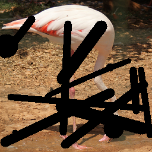
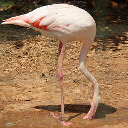
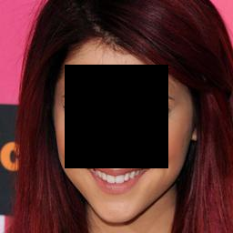
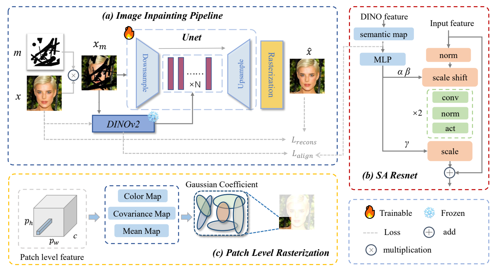
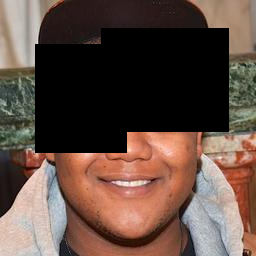
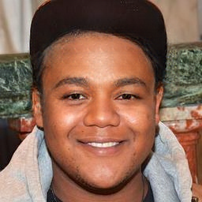
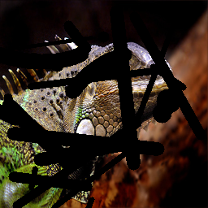
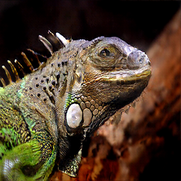

<div align="center">

# 2D Gaussian Splatting with Semantic Alignment for Image Inpainting


<a href=https://arxiv.org/abs/2509.01964></a> &nbsp;
<a href="https://opensource.org/licenses/MIT"></a>
<!-- <a href=''></a> &nbsp; -->


<p style="font-size: 14px;">
<strong>
Hongyu Li<sup>1</sup></a>,
Chaofeng Chen<sup>2</sup></a>, 
Xiaoming Li<sup>3</sup></a>, 
Guangming Lu<sup>1</sup></a>
</strong>
<br>
<sup>1</sup>Harbin Institute of Technology, Shenzhen
<sup>2</sup>Wuhan University
<sup>3</sup>Nanyang Technological University
</p>

[]() &nbsp; 
[]() &nbsp; 
[]() &nbsp; 
[]() 

</div>


### Open Source Plan
- [x] Release all codes
- [ ] Release checkpoints

## 📰 News
- **2025.09.12** 🔥 Code for both training and inference is released!

## 🔍 Introduction
This is the official repository for the paper **2D Gaussian Splatting with Semantic Alignment for Image Inpainting**.




## 📝 Examples
<details>
<summary>Inpainting results on different datasets</summary>

| **Dataset**       | **Input (Masked Image)**                                                                 | **Output (Inpainted Image)**                                                              |
| ------------------ | ---------------------------------------------------------------------------------------- | ----------------------------------------------------------------------------------------- |
| **CelebA-HQ**          | [](https://streamable.com/e/r0imrp) | [](https://streamable.com/e/r0imrp)  |
| **Places2**            | [](https://streamable.com/e/r0imrp)| [](https://streamable.com/e/l1pzws) |
| **Imagenet-100**       | [](https://streamable.com/e/r0imrp)| [](https://streamable.com/e/2vqari)|

</details>


## 🔧 Environment Preparation
Our default environment is based on **CUDA 12.1**. You can find alternative PyTorch installation commands on [PyTorch.org](https://pytorch.org/get-started/previous-versions/).

```
# create conda
conda create -n gsinpaint python=3.10
conda activate gsinpaint

# install pytorch
pip install torch==2.2.2 torchvision==0.17.2 --index-url https://download.pytorch.org/whl/cu121 

# compile gaussian kernel
cd src/gaussian_cuda
pip install -e .[dev]
```


## 💾 Checkpoints
Download the **DINOv2** checkpoint [`dinov2_vitb14_pretrain.pth`](https://github.com/facebookresearch/dinov2)  
and place it under the `pretrained/` directory:


## 🚀 Training
If you would like to train the model from scratch, please follow these steps:  

1. **Prepare the dataset**  
      - Organize your dataset into image files.  
      - Create a `.txt` file containing the paths to all clean images.  
      - During training, masks will be generated automatically, so you do not need to provide a separate mask set.  
      - Example `train.txt`:  
      ```text
      /your_path/celeba-256/27049.jpg
      /your_path/celeba-256/17547.jpg
      ```
2. **Update training configuration**
      - Modify `configs/train_cfg.py` with your dataset paths and training hyperparameters. 

3. **Start training**
      ```
      python scripts/train.sh
      ```


## ⭐ Inference
Once you have a trained model, you can perform inference as follows: 

1. **Edit inference configuration**  
   - Fill in the required paths and options in `configs/inference_cfg.py`.  

2. **Run the inference script**  
   ```bash
   python scripts/inference.py
   ```
 

## 📊 Evaluation
We provide implementations for two commonly used metrics: **FID** and **LPIPS**.  

1. **FID**  
   - Make sure `pytorch-fid` is installed.  
   - Run the following command:  
   ```bash
   python -m pytorch_fid path/to/generated_images path/to/real_images
   ```
2. **LPIPS**
      - Edit ```src/eval/eval_lpips.py```
      - Run
      ```bash
      python src/eval/eval_lpips.py
      ```

## 🖖 Acknowledge
<b>We sincerely acknowledge the following excellent works, which greatly inspired this project:.</b><br>
[Generalized and Efficient 2D Gaussian Splatting for Arbitrary-scale Super-Resolution](https://github.com/ChrisDud0257/GSASR)<br>
[GaussianImage: 1000 FPS Image Representation and Compression by 2D Gaussian Splatting](https://github.com/Xinjie-Q/GaussianImage)<br>
[Pixel to Gaussian: Ultra-Fast Continuous Super-Resolution with 2D Gaussian Modeling](https://github.com/peylnog/ContinuousSR)<br>
[DINOv2: Learning Robust Visual Features without Supervision](https://github.com/facebookresearch/dinov2)<br>


## 📧 Contact
If you have any questions, please feel free to commit an issue or contact us at lihy12138@gmail.com

## 📕 License
This work is released under the [MIT License](LICENSE).


## 🔖 Citation
```bibtex
@misc{li20252dgaussiansplattingsemantic,
      title={2D Gaussian Splatting with Semantic Alignment for Image Inpainting}, 
      author={Hongyu Li and Chaofeng Chen and Xiaoming Li and Guangming Lu},
      year={2025},
      eprint={2509.01964},
      archivePrefix={arXiv},
      primaryClass={cs.CV},
      url={https://arxiv.org/abs/2509.01964}, 
}

```
